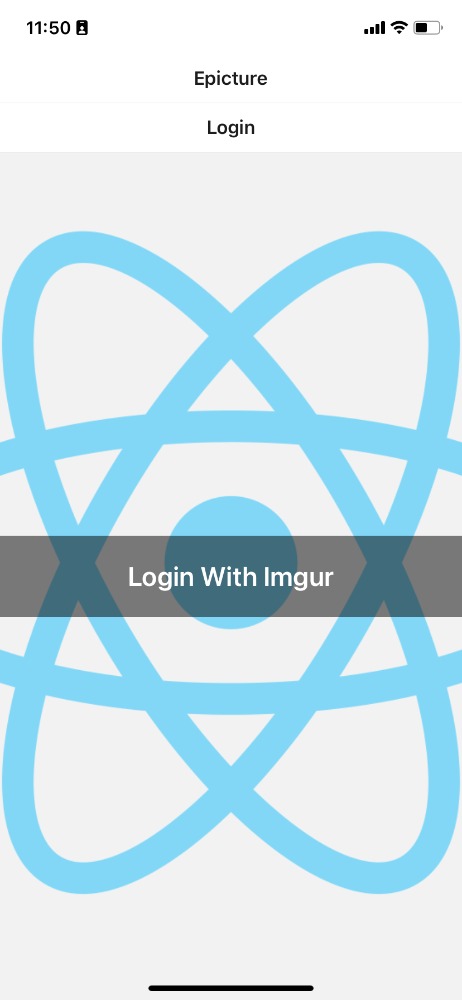
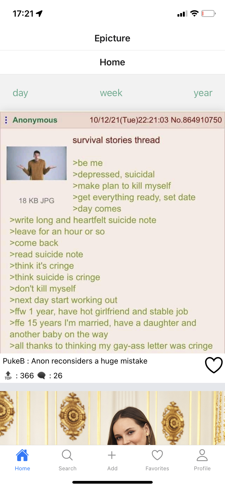
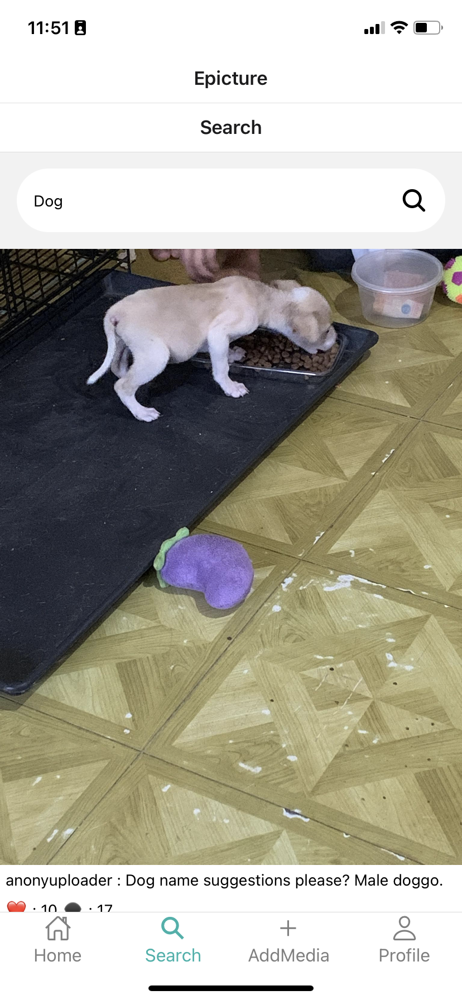
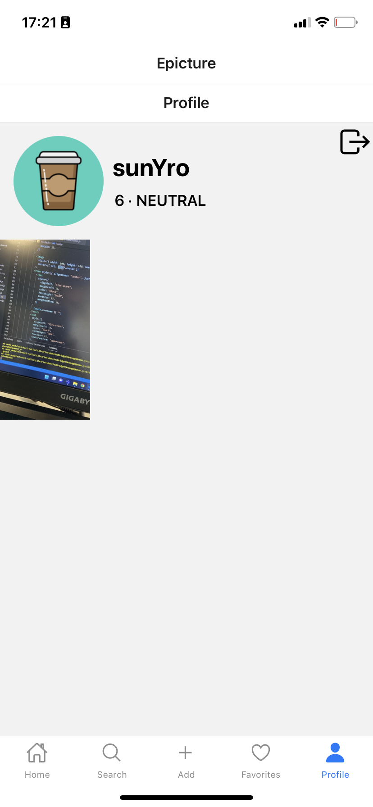

# Epicture

Epicture is an EPITECH school project, the goal is to create a mobile app based on the imgur API.  
The app is built with Expo (React Native) and is written in JavaScript

## Requirements

### The Expo Client App

With Expo, you don't have to manyally install the built APK or IPA on your phone.  
The Expo App will load the JS bundle and allow you to test my Epicture app without deploying it or building it with Android Studio/XCode

Download links:
- [iOS](https://apps.apple.com/us/app/expo-client/id982107779)
- [Android](https://play.google.com/store/apps/details?id=host.exp.exponent)

### An imgur account

The app requires you to login with an imgur account, with email and password **only**: auth with Google or Social medias are not supported. You can create an account on the [imgur website](https://imgur.com/register).

## Run the App with no install

If you want to test the app without building local code, it is very simple:

- Install the expo app and create your imgur account
- Visist the [expo dev page](https://expo.dev/@sminorv/Epicture) of the project and scan the QR Code with the Expo app or your phone camera

- Enjoy the app with your Imgur account

## Build the app

### Create an imgur Oauth2 application

The Oauth2 application is required to request the public API. A callback URL is set in the app and is depedent of you IP because of how Expo works. The calback URL must be `exp://your_dev_server_address`  
- [create the Oauth App here](https://imgur.com/account/settings/apps).  
- replace the callback URL and client id variables in the `.env.example` by your own
- rename the the `.env.example` to `.env`.

### Run with Expo

To launch the app:
- Install the expo client on your phone
- Run `yarn install` to install dependencies
- Run `yarn start` to start the development server
- Scan the QR code displayed in your terminal with your phone

## App Preview

### Login 

  

### Feed

  

### Search

  

### Profile

  

## Authors
- [DIOP Doudou](https://github.com/Douzdiop)
- [FREGONA Tristan](https://github.com/Tfregona)
- [SULON Adrien](https://github.com/asulon1)
